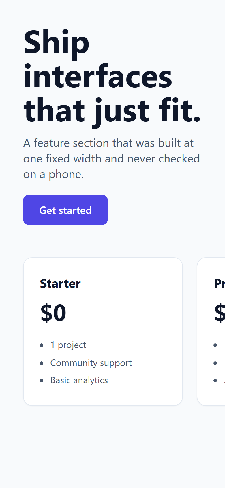
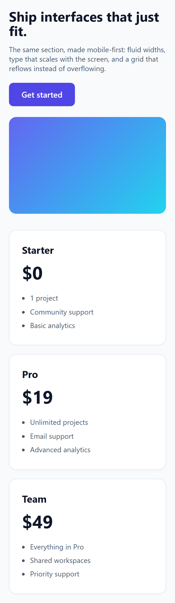
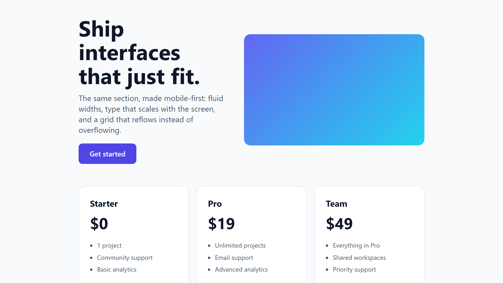

# mobile-responsive

[](https://skills.sh/AsadSumbul/mobile-responsive)
[](./LICENSE)
[](https://www.buymeacoffee.com/AsadSumbul)

An [Agent Skill](https://agentskills.io) that helps an AI agent build web UI
that's mobile friendly, responsive across devices, free of overflow, and
visually consistent with the rest of the project.

It works with Claude Code, Cursor, Codex, Copilot, OpenClaw, and any other
runtime compatible with [Agent Skills](https://agentskills.io). It's plain
markdown, so there's no lock-in.

## What it does

- Checks layouts across the full range of devices, from 320px phones up to large
  desktops, including landscape and tablet sizes.
- Treats horizontal scroll as a bug and fixes it at the source: fixed widths,
  unshrinkable flex children, wide media and tables, long strings, `100vw`, and
  the rest.
- Goes past "not broken" and actually reflows columns, scales type with
  `clamp()`, protects whitespace, and enforces tappable targets and readable
  line lengths.
- Reads the project's existing spacing scale, type scale, breakpoints, and
  design tokens before writing anything, then matches them so new UI fits with
  what's already there (and what comes later).
- Knows the common stacks: Tailwind, plain CSS/SCSS, CSS Modules,
  styled-components/Emotion, Bootstrap, and Flutter web.

## Install

The easiest way is the skills CLI, which installs it into the right folder for
your agent automatically:

```bash
npx skills add AsadSumbul/mobile-responsive
```

Or clone it and drop it into your agent's skills folder by hand:

```bash
git clone https://github.com/AsadSumbul/mobile-responsive.git
mkdir -p .claude/skills
cp -r mobile-responsive .claude/skills/
```
For other agents, copy the folder into that agent's skills directory, e.g.
`.agents/skills/` or `.cursor/skills/`.

## Use

Just ask for UI work and the skill triggers on its own:

> "Build a pricing section."
> "Make this page mobile friendly."
> "It's overflowing on my phone, fix it."

## Usage example

Here is the same pricing section before and after the skill ran, both shown at
a 390px phone width:

| Before | After |
|:------:|:-----:|
|  |  |

The "before" was built at a fixed 960px width and never checked on a phone, so
it spills off the screen. The "after" is mobile-first: fluid widths, type that
scales with `clamp()`, and a card grid that reflows to one column instead of
overflowing.

The responsive version still looks right on a wide screen:



You can reproduce these shots from the demo pages in `assets/` with
`node assets/capture.js` (needs Playwright).

## Optional: overflow checker

There's a Playwright script that scans a running URL at every device width and
reports exactly what overflows.

```bash
npm i -D playwright && npx playwright install chromium
node scripts/check-overflow.js http://localhost:3000
```

## Structure

```
mobile-responsive/
├── SKILL.md                         # entry point: workflow + rules
├── references/
│   ├── breakpoints.md               # device matrix, container queries, fluid type
│   ├── overflow-prevention.md       # every overflow cause + fix + debugging
│   ├── design-consistency.md        # matching existing/future design language
│   └── frameworks.md                # stack-specific syntax
├── scripts/
│   └── check-overflow.js            # optional automated overflow audit
├── assets/                          # demo pages + screenshots for the README
├── README.md
└── LICENSE
```

## Contributing

Contributions are welcome. The most useful additions are new framework recipes,
overflow edge cases, and breakpoint refinements.

To contribute:

1. Fork the repo and create a branch for your change.
2. Make the change, and test it against a real layout if it touches behavior.
3. Open a pull request describing what you changed and why.

A few things to keep in mind:

- Keep `SKILL.md` focused and under about 500 lines. Push longer detail into the
  files under `references/`.
- Match the existing tone and structure of the docs.
- For overflow fixes, include the cause as well as the fix so others understand
  the reasoning.

If you are not sure whether something fits, open an issue first and we can talk
it through.

## Support

If this skill saved you some time, you can
[buy me a coffee](https://www.buymeacoffee.com/AsadSumbul).

## License

MIT. See [LICENSE](./LICENSE).
