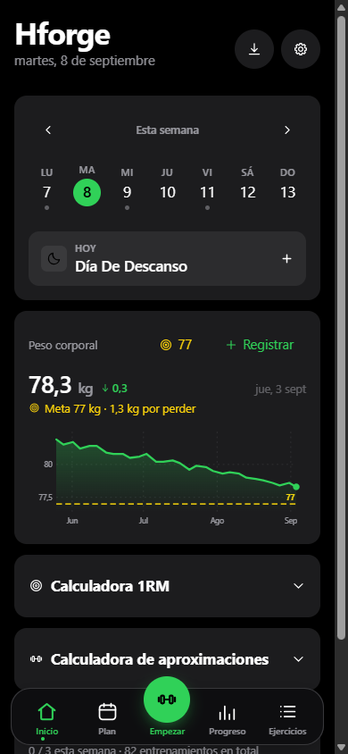
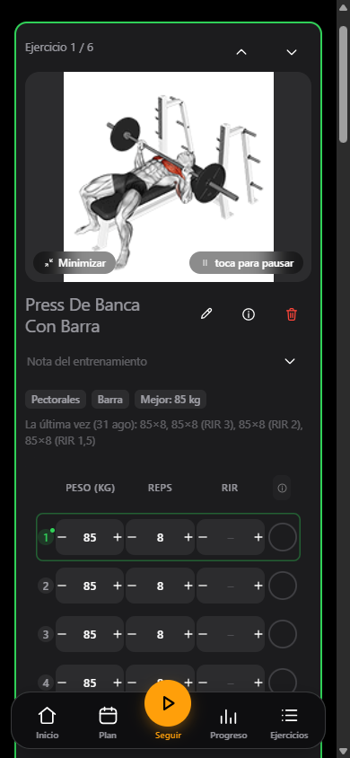
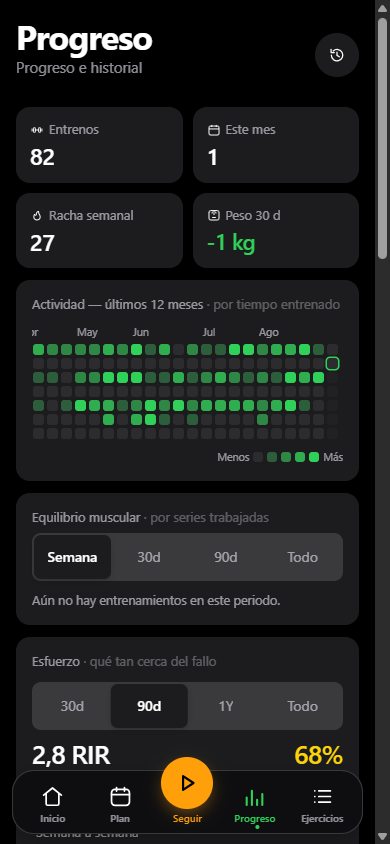
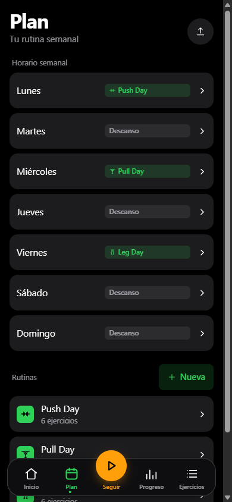
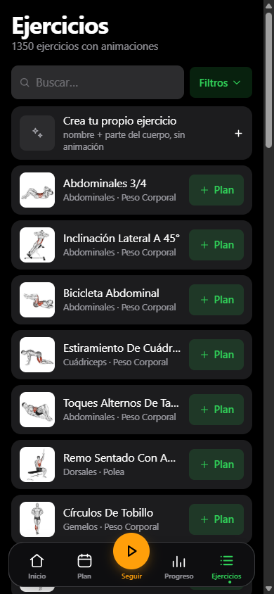
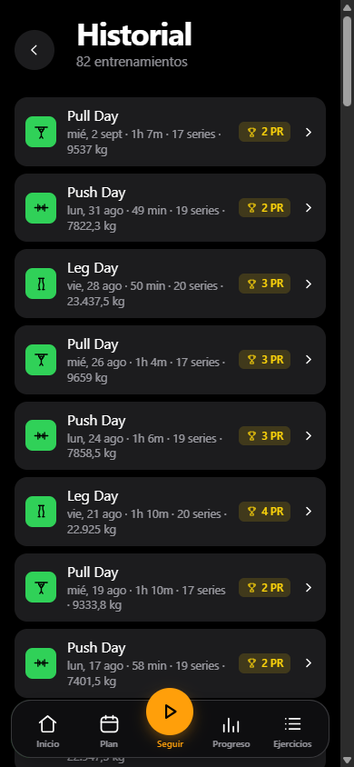

<div align="center">


<br>

**Tu aplicación autoalojada para registrar entrenamientos, peso corporal y progreso.**

Planifica la semana, sigue entrenamientos guiados y conserva tus datos en tu propio servidor o
en tu teléfono. Sin suscripción, anuncios ni telemetría.

</div>

## Galería móvil

Las capturas siguientes se tomaron desde el navegador integrado de **Orca Browser**, con emulación
**iPhone 12**: área visible de **390 × 844 CSS px**. Para evitar el mosaico vertical que produce
Orca al capturar con DPR 3, los PNG conservan un único viewport limpio de **390 × 844 px**. La
vista de entrenamiento se capturó después de esperar a que la red quedara inactiva y comprobar que
sus seis GIF tenían `naturalWidth` y `naturalHeight` de 180 px, sin imágenes rotas.

<div align="center">
<table>
<tr>
<td align="center"><br><sub><b>Inicio</b> — peso corporal, meta y resumen</sub></td>
<td align="center"><br><sub><b>Entrenamiento</b> — GIFs, series y RIR</sub></td>
<td align="center"><br><sub><b>Progreso</b> — actividad, esfuerzo y curvas</sub></td>
</tr>
<tr>
<td align="center"><br><sub><b>Plan</b> — calendario y rutinas</sub></td>
<td align="center"><br><sub><b>Ejercicios</b> — catálogo y filtros</sub></td>
<td align="center"><br><sub><b>Historial</b> — sesiones y marcas personales</sub></td>
</tr>
</table>
</div>

## Qué es Hforge

Hforge es un registrador de gimnasio y peso corporal que se ejecuta donde tú decidas. El servidor
guarda los perfiles y el historial en archivos JSON bajo `./data`; el navegador ofrece una PWA
instalable y el acceso puede protegerse con claves de acceso (passkeys). También existe una compilación móvil
independiente que no necesita servidor.

Incluye:

- planes semanales por día y editor de rutinas;
- entrenamientos guiados con GIFs reales de ejercicios, temporizador de descanso y pantalla activa;
- series con peso, repeticiones, tiempo, cardio, superseries, RIR o RPE y repeticiones por lado;
- progresión lineal, Greyskull LP, doble progresión y progresión por tiempo;
- estimación de 1RM, calculadoras de 1RM y de aproximaciones;
- seguimiento de peso corporal, metas, actividad, músculos, esfuerzo y marcas personales;
- catálogo de **más de 1.300 ejercicios**, búsqueda, filtros por equipamiento y ejercicios propios;
- importación desde FitNotes, Strong, Hevy y Apple Health, además de copia de seguridad JSON;
- temas claro/oscuro, ocho colores de acento, 12 idiomas y notificaciones opcionales;
- modo invitado para usarlo sólo en el navegador y perfiles con passkey para sincronización.

## Pantallas principales

| Pantalla | Qué muestra |
|---|---|
| **Inicio** | Semana actual, entrenamiento del día, peso corporal, meta, racha y calculadoras. |
| **Plan** | Horario semanal, rutinas, número de ejercicios y edición del plan. |
| **Entrenamiento** | Sesión guiada, GIF del ejercicio, última sesión, objetivos, series, RIR/RPE y notas. |
| **Progreso** | Actividad anual, equilibrio muscular, esfuerzo, peso corporal, progreso por ejercicio y sesiones recientes. |
| **Historial** | Lista completa de entrenamientos con duración, series, volumen y marcas personales. |
| **Ejercicios** | Catálogo buscable con animaciones, filtros y opción de crear ejercicios propios. |
| **Ajustes** | Passkeys, idioma, unidades, temporizadores, apariencia, notificaciones, importación y exportación. |

## Arranque local en Windows

Requisitos: Node.js 22 o posterior, npm y las carpetas locales `media/img` y `media/gif` con el
media de ejercicios.

### Opción rápida

Ejecuta `start-local.bat` desde la raíz o haz doble clic en él. El script inicia la interfaz web, la API y
servidor de media juntos, crea `data-local/` y usa **8080 por defecto** para Vite; también usa
`3000` para la API y `8888` para el media interno. El archivo `.bat` no acepta aquí un parámetro
de puerto alternativo: si `8080` está ocupado, no lo uses para esta sesión.

### Previsualización o capturas sin ocupar 8080

Para esta galería, `8080` estaba ocupado y se usó **4174** (4173 también estaba ocupado). La
interfaz web se inició manualmente con el puerto de Vite, sin cambiar `start-local.bat` ni la
configuración de producción. En tres terminales de PowerShell, desde la raíz:

```powershell
npm --prefix frontend install
npm --prefix api install

node scripts/serve-media.mjs
npm --prefix api start
npm --prefix frontend run dev -- --host 127.0.0.1 --port 4174
```

Abre `http://127.0.0.1:4174/`. Vite mantiene el proxy de `/api`, `/img` y `/gif` hacia la API en
`3000` y el servidor de media en `8888`. Cierra sólo las terminales que hayas iniciado tú.

## Docker, HTTPS y passkeys

La ruta recomendada para autoalojar es Docker Compose:

```powershell
git clone https://github.com/h5uarez/hforge
Set-Location hforge
Copy-Item .env.example .env
# Edita EXERCISE_MEDIA_SOURCE para apuntar a una carpeta con images/ y videos/.
docker compose up -d --build
```

La instancia web queda en `http://localhost:8080` cuando se usa la configuración predeterminada.
En el primer arranque se copia el media de ejercicios a `media/img` y `media/gif`. Para detenerla:

```powershell
docker compose down
```

Las passkeys usan WebAuthn y están vinculadas exactamente a `RP_ID` y `ORIGIN`. Los navegadores
permiten passkeys en `http://localhost`, pero para otro equipo o teléfono hace falta un nombre de
host real con **HTTPS**. Coloca Hforge detrás de un proxy TLS como Caddy, Cloudflare Tunnel,
Traefik o nginx, ajusta esos dos valores al dominio y vuelve a ejecutar Compose. Cambiar `RP_ID`
después de registrar perfiles invalida sus passkeys anteriores.

Consulta la [guía de autoalojamiento](docs/SELF_HOSTING.md) para HTTPS, usuarios, notificaciones,
copias y resolución de problemas.

## Datos de demostración de seis meses

La importación es opcional y sólo sirve para una demostración o una captura con las pantallas llenas. Si
existe este archivo fuera del repositorio:

```text
C:\Users\humbe\AppData\Local\Temp\opencode\hforge-seed-6m\seed.json
```

abre **Ajustes → Datos → Importar copia** y selecciona `seed.json`. Es un historial sintético de
aproximadamente seis meses; sustituye los datos locales del navegador y no representa datos
personales ni datos de producción. Después de la captura, restablece el navegador o importa tu
propia copia. No copies este archivo ni ninguna copia de seguridad de prueba al repositorio.

## Copias, importación y privacidad

- **Exportar copia (JSON)** guarda el estado completo del perfil para conservarlo o moverlo.
- **Importar copia** restaura una copia de seguridad y reemplaza los datos locales actuales después de pedir
  confirmación.
- Los importadores de FitNotes, Strong, Hevy y Apple Health permiten traer historial y peso; los
  ejercicios que no se reconocen se conservan como ejercicios propios.
- En el servidor, `./data` contiene perfiles, estados, passkeys públicas, sesiones y credenciales
  de notificaciones. Respaldar esa carpeta equivale a respaldar la instancia; protégela y no la
  subas al repositorio.
- Las claves privadas de las passkeys permanecen en el dispositivo o en el gestor de credenciales.
- El modo invitado guarda el estado sólo en `localStorage` del navegador. Limpiar sus datos lo
  elimina; no llega a la API.
- Hforge no incorpora telemetría. Las notificaciones requieren una suscripción explícita y, para
  funcionar en segundo plano, HTTPS o `localhost`.

## Android, iOS y PWA

La aplicación móvil usa Capacitor y comparte el código de la interfaz web:

```powershell
Set-Location frontend
npm install
npm run build:mobile
npx cap open android
npx cap open ios
```

- **Android:** se puede compilar y firmar un APK propio o descargar el APK publicado en
  [hforge.duarte-santos.ch](https://hforge.duarte-santos.ch). No se distribuye mediante Play Store.
- **iOS:** no hay una descarga `.ipa` directa. Usa la instancia autoalojada desde Safari y añade
  la PWA a la pantalla de inicio, o compila la app con Xcode y tu propio dispositivo.
- **PWA:** en un dominio HTTPS, abre Hforge en el navegador del teléfono y usa “Añadir a la
  pantalla de inicio”. La PWA conserva la experiencia web, las passkeys y la sincronización.

Los detalles de Capacitor, almacenamiento local, firmas y compilación están en
[docs/MOBILE.md](docs/MOBILE.md).

## Arquitectura

```text
┌─────────────────────┐       HTTPS        ┌──────────────────────────┐
│ Navegador / PWA     │ ─────────────────▶ │ web: nginx               │
│ o app Capacitor     │                     │ app estática + /api      │
└─────────────────────┘                     └────────────┬─────────────┘
                                                         │
                                           ┌─────────────▼─────────────┐
                                           │ api: Node + WebAuthn      │
                                           │ ./data/*.json             │
                                           └───────────────────────────┘
```

- `frontend/`: React 19, Vite, React Router y Zustand; las vistas están en `src/views`, los
  componentes en `src/components` y la lógica pura en `src/lib`.
- `api/`: servidor Node sin framework, passkeys con `@simplewebauthn/server` y notificaciones con
  `web-push`.
- `web/`: imagen multi-etapa que compila la interfaz web y la sirve con nginx, manteniendo API y
  aplicación bajo el mismo origen.
- `media/`: servidor local de imágenes y GIFs para desarrollo; Docker monta el mismo media en la
  imagen web.
- `frontend/android/` y `frontend/ios/`: envoltorios Capacitor para las compilaciones nativas.

## Variables de entorno

Configúralas en `.env`; la referencia completa está en [.env.example](.env.example).

| Variable | Uso | Valor predeterminado |
|---|---|---|
| `EXERCISE_MEDIA_SOURCE` | Carpeta local con `images/` y `videos/` para importar el media | Debe definirse |
| `RP_ID` | Hostname asociado a las passkeys | `localhost` |
| `ORIGIN` | URL completa que verá el navegador | `http://localhost:8080` |
| `WEB_PORT` | Puerto publicado por Docker para la web | `8080` |
| `RP_NAME` | Nombre mostrado en el diálogo de passkey | `Hforge` |
| `ADMIN_UIDS` | IDs opcionales con acceso al panel de administración | Vacío |
| `INVITE_ONLY` | Exige código de invitación para nuevos perfiles | Desactivado |
| `IMAGE_TAG` | Etiqueta opcional del Compose de producción | `latest` |
| `SESSION_DAYS` | Duración opcional de nuevas sesiones | `90` |

## Pruebas

Para la lógica de entrenamiento y la interfaz web:

```powershell
Set-Location frontend
npm test
npm run build
```

Para el servidor:

```powershell
Set-Location ..\api
npm test
```

La [guía para contribuir](CONTRIBUTING.md) describe la estructura, las reglas de pruebas y el
flujo de desarrollo. También puedes consultar [CHANGELOG.md](CHANGELOG.md), [SECURITY.md](SECURITY.md)
y [NOTICE.md](NOTICE.md).

## Enlaces locales

- [Autoalojamiento](docs/SELF_HOSTING.md)
- [Compilación móvil](docs/MOBILE.md)
- [Contribución](CONTRIBUTING.md)
- [Seguridad](SECURITY.md)
- [Cambios](CHANGELOG.md)
- [Avisos de terceros](NOTICE.md)
- [Contrato de configuración](.env.example)
- [Repositorio en GitHub](https://github.com/h5uarez/hforge)
